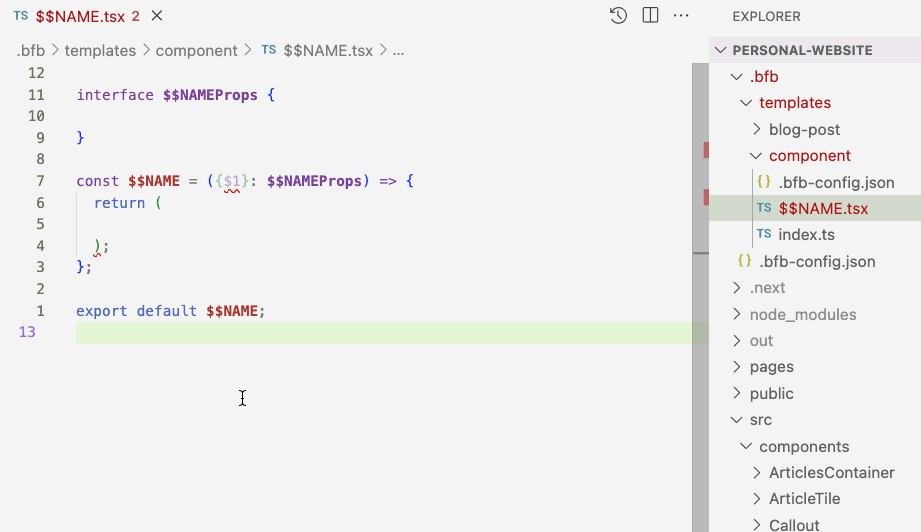

# Blazingly Fast Boilerplates (BFB)

With Blazingly Fast Boilerplates (BFB) you can create your boilerplates blazingly fast!

## Motivation behind BFB

Hi, I’m a Frontend Developer and I created a lot of UI views, components, pages in my life. Each one of them had the same beginning: create new folder, create files, `index.ts`, add export to the global `index.ts`, etc. It was frustrating.

I used snippets, but they did not 100% solve the problem: files & folders still should be created and export still should be added to a "global" `index.ts`. Also, I, personally, am not a fan of snippets UX (both creating & using).

So, I decided to create an extension that will solve my problem and I could create boilerplates blazingly fast!

## About BFB (Blazingly Fast Boilerplates)

There’re 3 entities: variables, templates and boilerplates. BFB creates a boilerplate by coping a template and replacing its variables with values provided by you.

For example, we can create a `component` template with one variable `$$NAME`, and it's gonna have two files:

`$$NAME.component.tsx`:

```tsx
interface $$NAMEProps {

}

const $$NAME = ({}: $$NAMEProps) => {
  return (

  );
};

export default $$NAME;
```

`index.ts`:

```tsx
export { default } from "./$$NAME.component.tsx";
```

And each time we need a component, we simply run a “Create boilerplate” command from VS Code commands dropdown (cmd+shift+p), provide a value for `$$NAME` and vuala — boilerplate is created and ready to go! **Blazingly fast!**

## How to start?

### Download the extension

BFB extension is not on the marketplace yet, so you should manually download it and install. Don’t worry, it’s easy:

1.  Download the extension. Here’s a [link](https://kuzmenchuk.com/bfb).
2.  In the VS Code, open the commands dropdown (cmd+shift+p) and choose the **"Extensions: Install from VSIX"**
3.  Choose the extension file.
4.  Extension should be installed.

### Add your first template

After the extension is installed, open the commands dropdown and choose the **"BFB: Add New Template"**. It will invoke the flow:

1.  If it is your first run:
    1. you’re gonna see the message about adding the folder with templates to `.prettierignore` file. If you use Prettier, I recommend you to add a BFB folder to `.prettierignore` for better UX. Make a choice and let’s move forward.
    2. the extension gonna ask you to add a variable(s) to continue.
    3. Provide a variable name, that you gonna use while defining a template. It should be uppercase, snake case with two dollar signs at the beginning, like `$$NAME`
    4. You can add more variables if you need to.
2.  Provide the template name.
3.  Choose which variables you wanna use with this template.
    You can use chosen variables while defining the template & you will have to provide value for them while creating a boilerplate.
4.  Select the folder, where the boilerplates will be created.
5.  Choose if the boilerplate should be created in its own folder or not.
    `/src/components/$$NAME.tsx` vs `/src/components/$$NAME/[..files]`
    1. If it should be created in a folder, please provide the variable for folder name.
6.  Provide boilerplate filenames.
    You can use your variables here.
7.  Choose which file should be opened after boilerplate is created.
8.  Do you want to append a string to some global file?
    It is useful if you use export from the folders, like `src/components/index.ts`
    1. Select the file to which you wanna append a string
    2. Provide the string pattern.
       You can use `\n` for a new line and template variables
9.  The template config is created!
10. Now define the files and you're ready to create boilerplates blazingly fast!
    REMEMBER: You can type `$1` in the template to place the cursor after creating a boilerplate.

### "BFB: Create Boilerplate..."

This is the reason why the extension exists. Create boilerplates blazingly fast!

1.  Choose the template you wanna use (if there’s only one template, it will be chosen by default)
2.  Provide the values for the variables
3.  Wasn’t it blazingly fast?!



### "BFB: Add New Variable"

1.  Provide variable name
2.  Repeat the flow if you wanna add more variables or finish it.

## About BFB Directory

When you run the extension for the first time, it will create a `.bfb` directory in your root folder.

`.bfb` The main folder, where all BFB files exist.

`.bfb/.bfb-config.json` — global config. See more [here](https://github.com/kuzmenchuk/blazingly-fast-boilerplates/blob/main/src/types/index.ts#L46).

`.bfb/templates` — folder with all templates. All created templates are put here, in a separate folder.

`.bfb/templates/[...templateName]` — single template folder

`.bfb/templates/[...templateName]/.bfb-config.json` — single template config. More info’s [here](https://github.com/kuzmenchuk/blazingly-fast-boilerplates/blob/main/src/types/index.ts).

`.bfb/templates/[...templateName]/[...files]` — all other template files that are defined by the user.

- When creating a boilerplate, these files will be copied & variables will be replaced with values provided by the user.
- Variables can be used in the filenames and in the file content.
- `$1` can be used for the cursor placement, after opening boilerplate file.

---

If you have any questions, feel free to write me.
